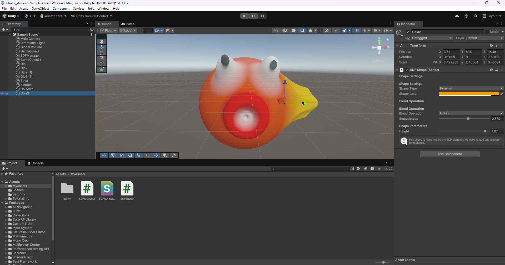

# Editor de SDF (Signed Distance Fields) para Unity



## 📋 Descripción

Editor visual de formas SDF (Signed Distance Fields) en Unity que utiliza técnicas de **raymarching** para renderizar formas geométricas procedurales en tiempo real. Este proyecto permite crear, combinar y manipular formas 3D mediante funciones de distancia firmada, ofreciendo operaciones de mezcla suave (smooth blending) entre objetos.

## ✨ Características Principales

### 🎨 Formas SDF Disponibles
- **Esfera** - Forma básica esférica con radio ajustable
- **Caja** - Cubo con dimensiones personalizables en cada eje
- **Torus** - Forma de dona con dos radios configurables
- **Cápsula** - Cilindro con extremos redondeados definido por dos puntos
- **Pirámide** - Pirámide de base cuadrada con altura ajustable

### 🔧 Operaciones de Mezcla
Cada forma puede combinarse con otras mediante tres operaciones:
- **Unión** - Combina formas aditivamente
- **Sustracción** - Resta una forma de otra
- **Intersección** - Mantiene solo la región donde las formas se solapan

Todas las operaciones soportan **smooth blending** para transiciones suaves entre formas.

### 🎯 Transformaciones
- **Posición** - Control completo de ubicación en el espacio 3D
- **Rotación** - Rotación mediante quaternions para precisión matemática
- **Escala** - Escalado no uniforme en cada eje (X, Y, Z)

### 🎨 Personalización Visual
- **Color por forma** - Cada forma tiene su propio color RGBA
- **Mezcla de colores** - Los colores se interpolan suavemente en las operaciones de blend
- **Iluminación difusa** - Sistema de iluminación básico con luz direccional y ambiental

## 🏗️ Arquitectura del Sistema

### SDFManager.cs
Gestor central del sistema que:
- Mantiene un registro de todas las formas SDF activas en la escena
- Actualiza los datos del shader en cada frame
- Gestiona el material de raymarching y el quad fullscreen
- Configura parámetros globales (max steps, max distance, surface distance)
- Soporta hasta **32 formas simultáneas**

**Parámetros de Raymarching:**
- `maxSteps`: Número máximo de iteraciones (default: 100)
- `maxDistance`: Distancia máxima de renderizado (default: 100)
- `surfaceDistance`: Precisión de detección de superficie (default: 0.001)

### SDFShape.cs
Componente que define formas individuales:
- Se registra automáticamente con el SDFManager al activarse
- Expone parámetros específicos según el tipo de forma
- Dibuja gizmos en el editor para visualización
- Permite configurar operación de blend y suavizado por forma

**Tipos de forma (SDFShapeType):**
```csharp
public enum SDFShapeType
{
    Sphere,    // Esfera
    Box,       // Caja
    Torus,     // Torus
    Capsule,   // Cápsula
    Pyramid    // Pirámide
}
```

**Operaciones de blend (SDFBlendOperation):**
```csharp
public enum SDFBlendOperation
{
    Union,         // Unión
    Subtraction,   // Sustracción
    Intersection   // Intersección
}
```

### SDFRaymarching.shader
Shader personalizado que implementa:
- **Algoritmo de raymarching** para renderizado volumétrico
- **Funciones SDF** para cada tipo de geometría
- **Operaciones de smooth blending** con mezcla de colores
- **Sistema de transformación** (rotación por quaternion + escalado)
- **Cálculo de normales** mediante gradiente para iluminación
- **Billboard rendering** para el quad fullscreen

**Funciones SDF implementadas:**
- `sdSphere()` - Distancia a esfera
- `sdBox()` - Distancia a caja
- `sdTorus()` - Distancia a torus
- `sdCapsule()` - Distancia a cápsula
- `sdPyramid()` - Distancia a pirámide

**Operaciones de blend:**
- `opSmoothUnion()` - Unión suave
- `opSmoothSubtraction()` - Sustracción suave
- `opSmoothIntersection()` - Intersección suave

## 🚀 Uso

### Configuración Inicial

1. **Crear el Manager:**
   - Añade un GameObject vacío a la escena
   - Agrega el componente `SDFManager`
   - El manager se configurará automáticamente como singleton

2. **Añadir Formas:**
   - Crea un GameObject vacío
   - Agrega el componente `SDFShape`
   - Selecciona el tipo de forma en el inspector
   - Ajusta parámetros (color, tamaño, operación de blend)

3. **Configurar Transformaciones:**
   - Usa las herramientas estándar de Unity (Move, Rotate, Scale)
   - Las transformaciones se aplican automáticamente al SDF

### Ejemplo de Uso

```csharp
// Crear una esfera mediante código
GameObject sphereObj = new GameObject("SDF Sphere");
SDFShape sphere = sphereObj.AddComponent<SDFShape>();
sphere.ShapeType = SDFShapeType.Sphere;
sphere.SphereRadius = 1.0f;
sphere.ShapeColor = Color.red;
sphere.BlendOperation = SDFBlendOperation.Union;
sphere.BlendSmoothness = 0.5f;
```

## 🎮 Controles en el Editor

- **Scene View Gizmos:** Cada forma muestra una representación wireframe de su geometría
- **Inspector:** Todos los parámetros son editables en tiempo real
- **Transform Tools:** Posición, rotación y escala funcionan como objetos normales de Unity

## 🔬 Detalles Técnicos

### Raymarching
El algoritmo de raymarching avanza a lo largo de un rayo desde la cámara, evaluando la función de distancia en cada paso. Cuando la distancia es menor que `surfaceDistance`, se considera que el rayo ha golpeado una superficie.

### Smooth Blending
Las operaciones de blend utilizan la técnica de **smooth minimum/maximum** que crea transiciones suaves entre formas. El parámetro de suavizado (`k`) controla el radio de influencia de la mezcla.

### Sistema de Transformación
- **Rotación:** Implementada mediante quaternions para evitar gimbal lock
- **Escalado:** Aplica corrección de distancia para mantener la precisión del SDF
- **Espacio local:** Cada forma se evalúa en su propio espacio de coordenadas

### Optimización
- Máximo de 32 formas simultáneas para mantener rendimiento
- Early exit en raymarching cuando se alcanza max distance
- Uso de arrays uniformes en el shader para datos de formas

## 📦 Requisitos

- Unity 2020.3 o superior
- Shader Model 3.0 o superior
- Soporte para arrays en shaders

## 🎨 Casos de Uso

- **Prototipado rápido** de formas complejas
- **Arte procedural** y efectos visuales
- **Modelado CSG** (Constructive Solid Geometry)
- **Visualización matemática** de funciones de distancia
- **Experimentación** con técnicas de raymarching

## 🔧 Personalización

### Añadir Nuevas Formas
1. Añade el tipo al enum `SDFShapeType`
2. Implementa la función SDF en el shader
3. Añade el caso en `EvaluateShape()`
4. Actualiza `SDFShape.cs` con los parámetros necesarios
5. Añade visualización en `OnDrawGizmos()`

### Modificar Iluminación
El sistema de iluminación se encuentra en el fragment shader (`frag()`). Puedes añadir:
- Luz especular
- Sombras suaves
- Ambient occlusion
- Reflexiones

## 📝 Notas

- El sistema usa `ExecuteAlways` para funcionar en modo editor
- Las formas se renderizan en orden de registro
- El color final resulta de la mezcla de todas las operaciones de blend
- Los gizmos muestran aproximaciones de las formas reales

## 🐛 Solución de Problemas

**Las formas no se ven:**
- Verifica que el shader `Custom/SDFRaymarching` esté compilado
- Asegúrate de que hay un SDFManager en la escena
- Revisa que las formas estén dentro del rango de `maxDistance`

**Rendimiento bajo:**
- Reduce `maxSteps` en el SDFManager
- Disminuye el número de formas activas
- Aumenta `surfaceDistance` para menos precisión pero más velocidad

**Artefactos visuales:**
- Aumenta `maxSteps` para más precisión
- Reduce `surfaceDistance` para mejor detección de superficie
- Verifica que las escalas no sean extremadamente pequeñas

---

**Desarrollado con ❤️ usando Unity y técnicas de raymarching**
